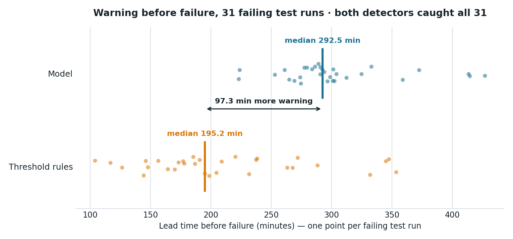
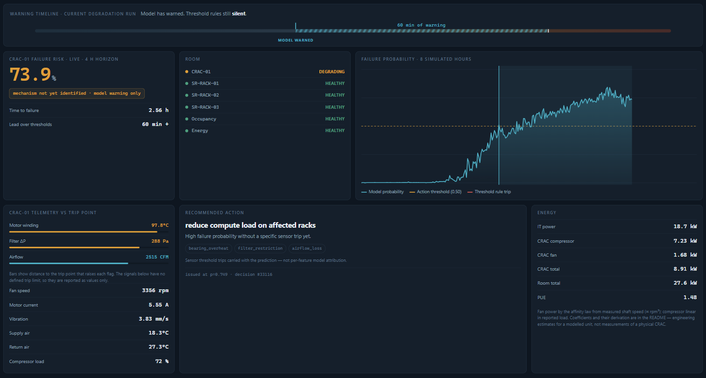
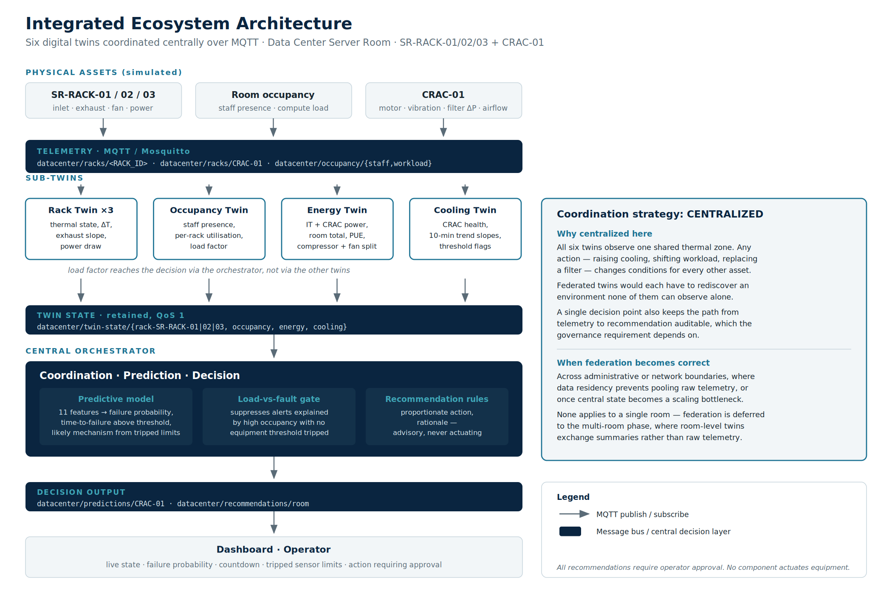

# Intelligent Data Centre Digital Twin

### Predictive cooling maintenance for a three-rack server room

**Project 2 — Intelligent Ecosystem & Strategic Optimization (Advanced)**

Team members

- Lourduraj John Charles (1011136)
- Syed Adeel Ahmed Mustaq Ahamed (1011010)
- Yang Xingyu (1010962)
- Kuhu Gupta (1010814)

Submission date: 16 August 2026

Repository: `github.com/johncharles-dev/Data_Center_Digital_Twin`, branch `main`
Live demonstration: `https://5090-server.tail391a63.ts.net/`

Every claim in this report cites a path and line in that repository. Every
number is measured, and the measurement is reproducible by the command given
beside it.

---
<div style="page-break-after: always;"></div>

## Executive summary

A cooling unit fails gradually. Its bearings wear, its filter loads, its motor
runs hotter — and none of that appears as room temperature until the failure is
nearly complete. A threshold alarm on rack temperature therefore reports a
problem that is already happening. This project predicts the failure instead.

Four sub-twins and a central orchestrator consume live MQTT telemetry from three
racks and one CRAC unit. A trained classifier reads eleven CRAC signals,
including two ten-minute trend features, and reports the probability of failure
within four hours. On the test set the model gives a **median 292.5 minutes of
warning against 195.2 minutes** from the same room's threshold rules — **1.5×
more** — and catches **31 of 31** failing runs at **0.08 false alarms per healthy
run** (§1). On the running system, the model crossed its action threshold **80.5
simulated minutes** before the first sensor limit tripped (§1.4).

The system distinguishes a busy room from a failing one. When risk is high but
compute load is high and no equipment limit has been breached, the orchestrator
withholds advice and says why — 143 of 437 predictions in a measured run (§2.4).
Nothing actuates: every output is advisory and every decision is recorded in a
hash-chained audit trail (§3).

The cooling energy this protects is real and modelled from telemetry rather than
assumed. A degrading unit draws **3.37 kW more** than a healthy one, and room PUE
moves **1.34 → 1.49** across a fault (§3.5).

What this is not: a validated product. The telemetry is simulated, one fault
profile is modelled, and no figure here has been checked against physical
hardware. The limitations are stated in each section rather than collected out of
sight.

---

## How to run this

One command, from a clean clone, on a machine with Docker and Python 3.11+:

```bash
git clone https://github.com/johncharles-dev/Data_Center_Digital_Twin.git
cd Data_Center_Digital_Twin
./run.sh
```

`run.sh` generates the broker credentials that are deliberately absent from the
repository, starts Mosquitto, then launches the twins, orchestrator, telemetry
simulator, occupancy publisher and audit sink. Verified from a genuine fresh
clone on 11 August 2026, at `run.sh --interval 0.4` (75x real time): **345
audited decisions in the first two minutes of wall clock — about 2.5 simulated
hours — hash chain intact, no authentication failures in any log**.

The interval is quoted because the count is a rate against the wall clock, not a
property of the system: the same two minutes at the `0.05` default covers eight
times the simulated span and audits roughly eight times as many decisions. The
simulated figure is the one that reproduces at any playback speed.

Useful commands once it is running:

```bash
python3 watch.py datacenter/predictions/CRAC-01   # live predictions
python3 audit/audit_sink.py --show 20             # recent decisions
python3 audit/audit_sink.py --verify              # check the audit chain
./serve_demo.sh                                   # publish the dashboard
./run.sh --stop                                   # stop the broker
```

The full test suite:

```bash
python3 tests/test_broker_security.py    # 8 access-control attempts
python3 tests/test_audit_chain.py        # 17 tamper/sequence assertions
python3 tests/test_energy_model.py       # 18 energy-model assertions
python3 tests/test_slope_units.py        # trend features match training units
python3 tests/test_substep_cap.py        # simulated clock, playback invariance
python3 tests/test_load_driven_branch.py # load-vs-fault branch reachability
```

All six pass as of 11 August 2026.

**A failure mode found in verification.** MQTT reports a refused credential in
CONNACK — *after* the socket has opened. A client that ignores that result code
goes on to subscribe and publish into a connection the broker has already
closed: it emits nothing, raises nothing, and looks healthy. We found this by
starting the stack with no per-service credentials during the audit. All seven
components were refused by the broker, and not one of them said so.

Both client paths now check the code and name the variable to set
(`twins/base_twin.py:95`, `orchestrator/orchestrator.py:110`):

```
[cooling] BROKER REFUSED THE CONNECTION: rc=5 (Connection Refused: not authorised.)
[cooling] this twin will publish nothing. Check MQTT_USERNAME_TWIN_COOLING /
          MQTT_PASSWORD_TWIN_COOLING, or run ./run.sh which exports them from
          mosquitto/credentials.json.
```

Re-verified after the change: the same wrong-credential start now reports the
refusal for every component, and a correct start still brings all seven to
`online` with predictions flowing. This is the class of defect that turns a
misconfigured demonstration into an unexplained blank screen, and it is the
reason the start-up path is a single scripted command rather than a list of
steps to follow by hand.

---
<div style="page-break-after: always;"></div>

## Continuity with Project 1

The brief asks for the initial twin to be *extended*. It is, and the extension is
in the telemetry contract rather than in the AnyLogic file — for a reason worth
stating plainly.

**What Project 1 delivered.** `SmartDataCenterTwin.alp` (Segment 1 — Asset &
Schema) is an asset drawing, not a running model. Parsed, it holds 2,051 XML
elements, of which 155 are positioned drawing objects: 77 labels, 33 text items,
22 lines, 15 ovals, 5 rectangles, a scale ruler and a level. It declares one
`ActiveObjectClass` ("Main") whose entire contents are the presentation canvas and
scene properties. There are **no** functions, events, statecharts, transitions or
flowchart blocks; `<Parameters>` is present and empty; of 159 CDATA blocks, none
contains a statement, a `return`, or a control-flow keyword. The eight `<Code>`
elements hold AnyLogic property defaults (`T extends Agent`, `10`, `1`, `1.0`).
It opens, and the run button does nothing, because there is no behaviour to run.

That is the correct deliverable for a segment named "Asset & Schema": it fixes the
room layout, names the assets and defines what each sensor measures. It is a
specification, and a specification is extended by implementing it, not by opening
it.

**What therefore carries forward is the contract.** Four things, all checkable:

| Inherited | Where it came from | Where it lives now |
|---|---|---|
| Payload schema — `timestamp`, `rack_id`, `location`, `inlet_temperature`, `exhaust_temperature`, `fan_speed`, `power_draw`, `status` | Segment 1 handover | `sensor_simulator.py:276`, unchanged |
| Asset IDs `SR-RACK-01/02/03`, `CRAC-01` | labels on the `.alp` canvas | `sensor_simulator.py:84-86`, identical strings |
| Topic tree `datacenter/racks/<RACK_ID>` | Segment 1 handover + Segment 3 dashboard | `TOPIC_BASE`, unchanged |
| Status rules — `WARNING` above 35 °C exhaust or 8.5 kW; `CRITICAL` above 40 °C, 7000 RPM or 9.0 kW | Segment 1 status rules | `sensor_simulator.py:348`, applied verbatim |

**Project 1's telemetry engine is this simulator.** `sensor_simulator.py` is
Segment 2's engine, carried over and extended in place — it still opens with the
Segment 2 header and still states its contract as "from Segment 1 handover +
dashboard.html". The baselines are the same numbers (inlet 20.0 °C, exhaust
30.0 °C, fan 4200 RPM, power 5.8 kW), and the rack payload is byte-compatible with
what the Segment 3 dashboard already consumed.

The Project 2 additions sit *alongside* that, deliberately: the `CRAC-01` stream
publishes to `datacenter/racks/CRAC-01`, inside the same topic family, so the
Segment 3 dashboard's `datacenter/racks/#` subscription picks it up with no
change. Extension by addition, not by replacement — the earlier deliverable keeps
working while the new assets appear next to it.

So the honest statement of lineage is: the schema, the asset identities, the topic
tree and the threshold rules are Project 1's and are unmodified; the failure
physics, the CRAC asset, the four sub-twins, the model and the orchestrator are
Project 2's. The `.alp` is not carried forward because there is nothing executable
in it to carry — a point made here rather than left for a reader to discover.

---
<div style="page-break-after: always;"></div>

## 1. Predictive intelligence

### 1.1 Purpose

Predict CRAC-01 failure early enough to schedule maintenance rather than react to
an outage, and prove the prediction beats the threshold rules it would replace.

### 1.2 Design decisions

**Predict the cause, not the symptom.** Rack temperature is the symptom of a
cooling fault and lags it by hours. The model reads CRAC-internal signals —
winding temperature, vibration, filter differential pressure, airflow — where the
fault actually develops.

**Two trend features, computed identically in training and inference.** The model
uses eleven features, nine instantaneous and two ten-minute slopes. The slopes are
where a naive implementation breaks: the training notebook computes
`diff(20)/20` over 30-second samples, so a slope is *change per sample*, not per
minute. `twins/cooling_twin.py:134` divides by elapsed samples using
`TRAINING_SAMPLE_INTERVAL_S` (line 28), and `twins/cooling_twin.py:39` measures
elapsed time from the payload's own timestamp rather than wall clock — necessary
because the simulated clock can run far faster than real time, and dividing
simulated change by wall-clock seconds inflates every slope by the acceleration
factor.

**Report time-to-failure only where the regressor has support.**
`inference/model_loader.py:26` gates the countdown at the action threshold. Below
it the field is `null` and the dashboard renders a dash — never a zero, which
would read as "failure imminent".

**Do not claim a mechanism classifier.** The artefact contains a classifier and a
regressor. `predicted_mode` is a rule over tripped sensor limits
(`inference/model_loader.py:29`) and is published alongside
`predicted_mode_basis: "rule"` so no consumer can mistake it for a model output.

### 1.3 Implementation

`notebooks/train_crac_model.ipynb`, committed with outputs. Grouped train/test
split on `run_id` stratified by outcome — a random row split would leak
near-identical consecutive samples across folds and produce a meaningless score.
Ground-truth columns are dropped before training.

Inference runs in `inference/model_loader.py`, which builds its feature vector
**by name** from the model's own saved `feature_cols` rather than a second
hardcoded list, making a feature-order mismatch impossible.

### 1.4 Evidence it works

**Figure 2 — Warning before failure, per failing test run.** Each point is one
of the 31 failing runs; the vertical rule is the median for that detector. The
model's median lead is 292.5 minutes against 195.2 from the same room's
threshold rules, a gap of 97.3 minutes. Both detectors caught all 31 runs, so
the medians are comparable. Regenerate with
`python3 docs/figures/make_lead_time_figure.py`, which scores the committed
model artefact and aborts rather than writing the figure if its numbers drift
from the notebook's.



Figure 2 is the project's central claim in one picture: the model's distribution
sits bodily to the right of the threshold rules', not merely ahead of it on
average.

**Table 1 — Model quality on the held-out test set**, from the committed
notebook outputs:

| Metric | Value | Source |
|---|---|---|
| AUC | 0.993 | cell 11 |
| Precision | 0.892 | cell 11 |
| Recall | 0.962 | cell 11 |
| F1 | 0.925 | cell 11 |
| False alarms per healthy run | 0.08 (1 run in 12) | cell 13 |
| Time-to-failure MAE, gradient boosting | 17.26 min | cell 15 |
| Time-to-failure MAE, linear regression | 31.16 min | cell 17 |

Linear regression is reported in Table 1 because the brief requires it, and is
retained even though gradient boosting is materially better. The false-alarm rate
in Table 1 is the check that the split design in §3.2 exists to protect.

The headline comparison behind Figure 2, cell 19:

```
Failing test runs: 31
Model     median lead time: 292.5 min (caught 31/31 runs)
Threshold median lead time: 195.2 min (caught 31/31 runs)
Lead-time multiple vs. MEASURED threshold baseline: 1.5x
```

The baseline is **measured on the same runs with the same function**, not assumed.
An earlier version of this notebook divided by a hardcoded ~50 minutes carried
over from planning, which would have overstated the multiple several-fold. Both
detectors caught all 31 runs, so the medians are comparable.

On the live system, measured 11 August 2026 over one complete degradation run:

> **The model crossed its action threshold 80.5 simulated minutes before the
> first sensor limit tripped.**

Reproduce by capturing a run and passing it to `tests/analyse_live_run.py`.
Figure 3 shows that window as an operator sees it, mid-run, with the model
already warning and every sensor still inside its limit.

**Figure 3 — The lead-time window, on the running system.** The dashboard during
a live degradation run. Failure risk reads **73.9 %** with **60 simulated
minutes of warning** already accumulated, and all three threshold flags —
`bearing_overheat`, `filter_restriction`, `airflow_loss` — are unlit. Every
plain threshold is still below its limit at that moment: motor winding
**97.8 °C** against a 105 °C trip, filter ΔP **288 Pa** against 350 Pa, and
airflow **2515 CFM** against a 2210 CFM floor. That is the argument of §1 in one
frame — a threshold monitor watching these same three signals would have raised
nothing at all, while the model sits at 0.739 with a 2.56 hour countdown and has
been warning for an hour. The banner says it plainly: *"Model has warned.
Threshold rules still silent."* The risk panel is equally careful about what is
not known — *mechanism not yet identified · model warning only* — because no
sensor limit has tripped, and the mechanism label is a rule over those limits
rather than a model output (§1.2).



### 1.5 Limitations

- **One fault profile.** Bearing wear coupled to filter loading. A different
  mechanism is outside the training distribution, and the model has no way to
  say so beyond a low probability.
- **Simulated telemetry.** No figure here has met a physical CRAC.
- **Trend features leave the trained range briefly at each demo cycle reset.**
  When the looping demonstrator "replaces" the unit, winding temperature drops
  ~120 → 65 °C in one sample, producing slopes far outside training. Measured:
  **40 of 600 samples (6.7%), all within 20 samples of a reset**, and they
  produce probabilities of 0.001–0.003, so no false alarm results. In a
  single-fault run (`--anomaly`) the condition does not arise.
- **`tests/analyse_live_run.py` assumes one run per capture** and reports FAIL on
  a looping capture for that reason. Segment by `run_id` before interpreting it.

---
<div style="page-break-after: always;"></div>

## 2. Ecosystem integration

### 2.1 Purpose

Coordinate four twin types over one shared physical environment so that a
decision accounts for the whole room, not one asset.

### 2.2 Design decisions

**Centralised coordination, chosen deliberately.** The four sub-twins publish
state; a single orchestrator fuses it and decides. Three reasons:

1. **One shared thermal zone.** All six twin instances observe the same air. Any
   action — raising cooling, shifting workload, replacing a filter — changes
   conditions for every other asset. A federated design would have each twin
   negotiating over an environment none of them can observe alone.
2. **Every action affects every asset.** There is no partition of this room into
   independently-decidable subsystems, so there is nothing for federation to
   decompose.
3. **A single auditable decision path.** One decision point means every
   recommendation has exactly one producer and one ordered record (§3.4). The
   governance requirement depends on that; distributed decision-making would make
   "who advised this, and on what evidence" a reconstruction problem.

This is a design position, not an omission. **Federation becomes correct** across
administrative or network boundaries, where data residency prevents pooling raw
telemetry, or once central state becomes a scaling bottleneck — none of which
applies to a single room. It is deferred to the multi-room phase, where room-level
twins would exchange summaries rather than raw telemetry (§4).

**Twins own their state and nothing else.** Each twin subscribes only to the raw
telemetry it needs and publishes only its own state topic. No twin subscribes to
another twin's state; occupancy reaches the decision through the orchestrator
(`orchestrator/orchestrator.py:148`). The ACL enforces this rather than trusting
it (§3.2).

**Occupancy changes the decision.** Load factor is what separates "the room is hot
because it is busy" from "the room is hot because the CRAC is failing"
(`orchestrator/orchestrator.py:36`).

### 2.3 Implementation

| Component | File | Publishes |
|---|---|---|
| Rack Twin ×3 | `twins/rack_twin.py` | `datacenter/twin-state/rack-SR-RACK-0{1,2,3}` |
| Occupancy Twin | `twins/occupancy_twin.py` | `datacenter/twin-state/occupancy` |
| Energy Twin | `twins/energy_twin.py` | `datacenter/twin-state/energy` |
| Cooling Twin | `twins/cooling_twin.py` | `datacenter/twin-state/cooling` |
| Orchestrator | `orchestrator/orchestrator.py:142` | `datacenter/predictions/CRAC-01`, `datacenter/recommendations/room` |

**Figure 1 — Integrated ecosystem architecture.** The full path from simulated
assets through telemetry, sub-twins and twin state to the central orchestrator
and its two decision outputs, with the coordination-strategy rationale alongside.
Vector source `docs/ecosystem_diagram.svg`.



Figure 1 is the reference for every topic name used in this report. Note what it
does not show: there are no arrows between twins, because no twin subscribes to
another twin's state.

The orchestrator re-runs inference only when cooling state changes
(`orchestrator/orchestrator.py:142`). Firing on every twin-state message meant
roughly ten inferences per simulated sample; at demonstration speed the
orchestrator fell behind the broker and stopped producing predictions three
quarters of the way through a run.

### 2.4 Evidence it works

All seven components connect and publish, verified by their retained liveness
topics: `datacenter/status/{cooling, occupancy, energy, rack-SR-RACK-01|02|03,
orchestrator}` all read `online`.

Occupancy demonstrably changes the outcome. In a 437-prediction measured run,
**143 predictions were withheld** with `recommendation_withheld: "load_driven"` —
risk above threshold, compute load above 0.8, no equipment limit breached. In an
earlier longer run, 165 of 247 warning-phase samples (67%) met that condition.

The coordination is visible in Figure 3. The recommendation there reads *reduce
compute load on affected racks*, issued at `p=0.749` — an action across the rack
and occupancy twins rather than a cooling action, chosen because risk is high
while no equipment limit has tripped. A cooling-only twin, seeing the same CRAC
telemetry, has no basis for proposing that and no rack to propose it to.

`tests/test_load_driven_branch.py` sweeps the reachable input space and asserts
the branch behaves:

```
PASS  prob=0.60 load=0.95 -> recommend=False  (high load explains it)
PASS  prob=0.60 load=0.95 -> recommend=True   (equipment tripped)
PASS  prob=0.60 load=0.10 -> recommend=True   (load is low)
PASS  prob=0.40 load=0.95 -> recommend=False  (below action threshold)
```

That test exists because the original predicate was **unreachable**:
`load_factor > 0.8 and failure_probability < 0.3`, evaluated only inside a branch
already gated on `probability >= 0.5`. The second conjunct was always false, so
occupancy could never suppress anything. It is now gated on the presence of an
equipment trip instead (`orchestrator/orchestrator.py:36`).

### 2.5 Limitations

- **Centralisation is a single point of failure.** If the orchestrator stops, the
  twins keep publishing state and nothing decides. Its liveness is published on
  `datacenter/status/orchestrator` so the condition is visible, but there is no
  standby.
- **`thermal_risk` is unimplemented.** `twins/rack_twin.py:42` notes the
  orchestrator would set it; nothing does. Rack thermal risk is therefore not
  part of any decision today.
- **Recommendation cost is not computed.** `orchestrator/rules.py:33` returns
  `None`, so no cost accompanies advice and the dashboard renders none.

---
<div style="page-break-after: always;"></div>

## 3. Governance and ethics

Full treatment in `docs/Governance_Ethics_Roadmap.docx` (sections A1–A5 and
B1–B2). This section states the measures and the evidence for them.

### 3.1 Purpose

A system that advises engineers must protect the integrity of its advice, keep a
record of what it advised and why, be honest about which of its outputs it can
justify, and be worth running. Four requirements — security, auditability,
transparency and return — and one constraint that governs all of them: a human
decides, not the system.

### 3.2 Design decisions

**Autonomy comes last, and bounded — that is the design, not an omission.** The
brief asks for an autonomous ecosystem. This system is autonomous in sensing,
inference and coordination — it decides, unprompted and continuously, what is
happening and what should be done about it — and it stops short of actuating,
which the roadmap defers to its final phase rather than abandoning. Why
actuation is the part that waits:

- **The action space is physical and expensive.** The four actions the
  orchestrator can recommend are replace a filter, schedule an inspection, shift
  workload between racks, and raise cooling. Three dispatch a technician or move
  live compute; the fourth raises energy draw across the room. None is reversible
  by publishing a correcting message, so the cost of a wrong action is not
  symmetric with the cost of a delayed one.
- **The model's own limits make unattended action unsafe.** §1.5 records that the
  classifier is trained on two failure mechanisms. A third mode puts it outside
  its training distribution, where it degrades to a low probability rather than an
  error — the system cannot tell "healthy" from "a fault I have never seen".
  Acting on that silence automatically converts a known blind spot into unattended
  physical action.
- **Advice is withheld precisely where autonomy would be most tempting.** When
  heat is explained by compute load rather than by a fault, the orchestrator
  declines to recommend and records why — 143 of 437 predictions in a measured run
  (§2.4). An autonomous loop would have no equivalent of declining; it would act,
  or it would need exactly this judgement encoded anyway.
- **Accountability requires an actor.** Every decision is hash-chained and
  attributable (§3.3). That record answers "why did this happen" only while a
  named person authorised the action. Closing the loop removes the human the
  audit trail exists to hold accountable, at the same time as it removes the
  operator's chance to catch a bad call.

None of that is an argument for never automating. It is an argument about
ordering and scope, and the roadmap states both: phase five (§4.3) introduces
bounded autonomy, restricted to setpoint changes within ±1 °C and workload
redistribution. The bound is chosen against the failure mode above — those are
the actions whose worst outcome, if the model is wrong or silent, is a slightly
warmer room. Control authority is granted in proportion to what has been
measured, and only for actions that stay safe when the model is at its weakest.

The mechanism such a step needs is already built and exercised rather than
hypothetical: `acknowledge.py` publishes an operator's response to
`datacenter/acks/room` under an `operator` identity that the ACL permits to
acknowledge and explicitly forbids from publishing recommendations. Until phase
five, the loop is closed by a human whose action is authenticated and recorded —
a narrower claim than autonomy, and a far easier one to defend on equipment that
has never been observed failing in the field.

**Security — every component authenticates as itself.** Twelve identities, one
per service, each with a least-privilege topic ACL (`mosquitto/acl`). This
matters because `main.py` runs six twins and the orchestrator in one process; a
single shared credential would collapse the ACL into one account holding the
union of all seven permissions. `mqtt_identity.py:36` resolves per-service
credentials with a fallback to a shared pair so existing deployments keep
working.

**Security — exactly one identity may publish a recommendation.** A
recommendation is the system's actuating output, the thing a human acts on, so
`orchestrator` alone holds `topic write datacenter/recommendations/room`. The
audit sink can read decisions and write nothing: it cannot forge what it records.
Secrets are never committed — `mosquitto/make_credentials.sh` creates a local CA,
a server certificate and twelve passwords on first run, all gitignored, so a
fresh clone cannot connect to anybody's broker. The public dashboard credential
is read-only by policy rather than convention, which is what makes it acceptable
to ship inside a page anyone can view-source.

**Auditability — the producer stamps the sequence number, not the recorder.**
A counter assigned on receipt can only count what arrived and could never reveal
a gap; stamping at the source (`orchestrator/orchestrator.py:171`) makes a lost
decision detectable. Records are hash-chained per source
(`audit/audit_sink.py:61`) because filesystem append-only flags require root,
whereas a hash chain makes tampering detectable with no privilege at all.

**Auditability — a decision to withhold is a decision.** The load-versus-fault
rule used to suppress advice silently, so a subscriber could not distinguish low
risk from risk attributed to compute load. Predictions now carry
`recommendation_withheld` and the load factor behind it
(`orchestrator/orchestrator.py:162`), which puts the suppression in the record
rather than leaving it to be inferred.

**Transparency — label the provenance of each output.** Each prediction carries
`predicted_mode` *and* `predicted_mode_basis: "rule"`
(`inference/model_loader.py:78`), so a subscriber inherits the distinction
between what the trained model produced and what a rule derived rather than
having to know it. The corresponding restraint: `contributing_factors` is the
CRAC's own tripped sensor limits passed through
(`inference/model_loader.py:77`), not per-feature attribution.

**Bias mitigation — design the evaluation so it cannot flatter the model.**
Four decisions, all made before any number was quoted:

1. **Split on runs, not rows.** Consecutive 30-second samples from one
   degradation are near-identical. A random row split puts almost the same
   sample in train and test and produces a score that measures memorisation.
   The split groups by `run_id` (notebook cell 9).
2. **Stratify the split by outcome.** A plain group split over 140 runs can, by
   chance, leave zero of the 39 healthy runs in the test fold — which would
   silently delete the false-alarm check. Each outcome is split separately and
   recombined (cell 9).
3. **Weight the classes.** Failure is the minority outcome at a 24.7% positive
   rate on the four-hour horizon, so an unweighted model can score well by
   under-predicting it. `class_weight="balanced"` (cell 11).
4. **Claim nothing the artefact cannot support.** There is no mechanism
   classifier, so no mechanism accuracy is claimed anywhere — a figure of that
   kind was removed from the executive pitch during verification rather than
   defended.

**Human oversight — nothing actuates.** `orchestrator/rules.py:7` produces an
action string and a rationale; no component sends a control signal to any
equipment. Operator acknowledgement is a separate identity (`acknowledge.py`,
ACL `operator`) that may acknowledge and may **not** recommend: the person acting
on a decision cannot author one.

### 3.3 Implementation

| Concern | Where it lives |
|---|---|
| Identities and topic permissions | `mosquitto/acl`, `mosquitto/make_credentials.sh` |
| Per-service credential resolution | `mqtt_identity.py:36` |
| Decision record | `audit/audit_sink.py` → `logs/audit.jsonl` |
| Producer sequence + withheld reason | `orchestrator/orchestrator.py:162`, `:171` |
| Output provenance | `inference/model_loader.py:29`, `:77`, `:78` |
| Energy and cost basis | `twins/energy_twin.py:76`, `:83`, `:86` |
| Acknowledgement | `acknowledge.py` |

The broker runs from `docker-compose.yml` with three listeners — plain MQTT on
loopback, TLS on 8883, and WebSockets for the browser, the last left plaintext
because Tailscale Funnel terminates TLS in front of it rather than
double-terminating.

### 3.4 Evidence it works

**Security.** `tests/test_broker_security.py` makes eight attempts against the
running broker and records the protocol response and matching broker log line.
MQTT v5 is used deliberately: under 3.1.1 a denied publish receives a normal
PUBACK, making "refused" indistinguishable from "delivered".

**Table 2 — Access-control transcript.** Eight attempts against the running
broker, each showing the protocol response and, where the broker logged one, the
refusal line. Reproduce with `python3 tests/test_broker_security.py`.

| # | Attempt | Observed |
|---|---|---|
| 1 | Connect with no credentials | `CONNACK 135 Not authorized`; log: `disconnected: not authorised` |
| 2 | Connect with a wrong password | `CONNACK 135 Not authorized` |
| 3 | A twin forges a **recommendation** | `PUBACK 135`; **not delivered**; log: `Denied PUBLISH from twin-cooling ... recommendations/room` |
| 4 | A twin forges another twin's state | `PUBACK 135`; log: `Denied PUBLISH ... twin-state/energy` |
| 5 | The dashboard credential tries to publish | `PUBACK 135` |
| 6 | The dashboard credential subscribes where permitted | `CONNACK 0`, `SUBACK 1` |
| 7 | The simulator subscribes to recommendations | messages delivered: **0**, while a permitted subscriber received the same publish |
| 8 | The orchestrator publishes a recommendation | `PUBACK 0 Success`, delivered |

**8 of 8 behave as the policy requires**, on five consecutive runs. Case 7 is
worth noting: Mosquitto grants the subscription and silently declines delivery
rather than refusing the SUBACK, so the property asserted is *no delivery*,
established by measurement rather than assumed from the config.

**The suite runs against the live broker rather than a fixture, and that choice
produced two findings of its own.** The first was mechanical: a case connected
using the client id the live cooling twin already held, and MQTT evicts an
existing session when a second client claims its id, so the test and the running
twin knocked each other off the broker. The second was substantive. That case
asked "did the subscriber receive anything?" while the real orchestrator was
publishing legitimate recommendations to the same topic several times a second —
so a forgery the broker had **correctly refused** still looked delivered, and the
suite failed intermittently on the case that proves the single-writer rule. The
security property was never broken; the measurement of it was. Each case now tags
its own payload and looks for that tag.

A fixture would have hidden both. It would also have made these results much less
worth quoting: what Table 2 reports is what the broker does under the traffic the
system actually generates, not what it does in isolation.

**Auditability.** `tests/test_audit_chain.py` proves the guarantee by breaking
it — 17 assertions covering a clean chain, a dropped decision flagged
`GAP(missing=2)`, a producer restart distinguished from a gap, independent
per-source chains, an **edited payload detected**, a **deleted record detected**,
and a sink restart that continues the chain rather than forking it. All pass. On
the running system, a two-minute clean-clone start produced 345 records with
every chain intact.

**Transparency.** Removing the threshold flags from a prediction input leaves the
probability unchanged at 0.662 while `contributing_factors` goes empty — the
model contributes nothing to that field, and the system does not pretend
otherwise. Reproduce with `inference/model_loader.py`'s `predict()` on any
cooling state.

**Bias mitigation.** The split produces 97 train and 43 test runs with every
outcome represented in both folds, and the false-alarm check that depends on it
returns **0.08 false alarms per healthy run — one run in twelve** (Table 1).
Withholding advice when load explains the heat is measured on the wire: **143 of
437 predictions** in one run, 165 of 247 warning-phase samples in another, and
`tests/test_load_driven_branch.py` sweeps the reachable input space to show the
branch behaves in all four quadrants.

**ROI.** Cooling energy is computed from telemetry, not assumed
(`twins/energy_twin.py:86`). Fan power follows the affinity law on measured shaft
speed, `P = 1.459 × (rpm/3200)³`, with the rated figure derived at the nominal
duty point — `Q·Δp/η = 1.6045 m³/s × 500 Pa / 0.55 = 1459 W`
(`twins/energy_twin.py:76`). Compressor power is linear in reported load,
`P = 10.0 × load%/100`, from 30 kW sensible capacity at COP 3.0
(`twins/energy_twin.py:83`) — linear because the modelled unit is a fixed-speed
scroll compressor that cycles, so mean power is proportional to run-time
fraction. Measured live across a fault:

| State | fan kW | comp kW | CRAC kW | IT kW | PUE |
|---|---|---|---|---|---|
| healthy | 1.46 | 5.50 | 6.96 | 18.6 | **1.37** |
| degrading | 1.64 | 7.00 | 8.64 | 21.0 | **1.41** |
| tripped | 1.83 | 8.50 | 10.33 | 23.4 | **1.44** |

Live range observed: **PUE 1.337 → 1.491**, CRAC draw **6.91 → 9.18 kW**. The
affinity law is why early detection pays — the fan runs 3200 → 3450 rpm while
degrading, a **7.8% speed rise that becomes 25% more fan power**. A degraded unit
draws **3.37 kW more** than a healthy one, SGD 14.55 per day at 0.18 SGD/kWh.
`tests/test_energy_model.py` asserts the model obeys the laws it claims — doubling
speed multiplies fan power by 8 — and that PUE stays in 1.25–1.60 and worsens
monotonically as the unit degrades. 18 assertions, all pass. The business case
built on this quantity is in `docs/Executive_Pitch.pptx`, which separates measured
from assumed figures and shows the case with every benefit halved.

### 3.5 Limitations

- **ACLs are enforced by the local broker only.** A cloud deployment via
  `render.yaml` points at an external broker where these identities would have to
  be provisioned separately.
- **The `viewer` password is public** by construction. Read-only, but anyone with
  the link can watch the simulated room.
- **Bias mitigation addresses evaluation, not coverage.** Grouping, stratifying
  and weighting stop the score from flattering the model on the data it has; none
  of it helps with a unit that fails by a mechanism absent from training. The
  model has seen two coupled mechanisms and one room geometry, and its confidence
  outside that is not a measure of anything.
- **The ROI case rests on one unmeasured quantity** — how long a fault would
  otherwise run undetected. It is an assumption this project cannot test, and the
  pilot phase exists to replace it.
- **Recommendation cost is not computed.** `orchestrator/rules.py:33` returns
  `None`, so no cost accompanies advice.

<div style="page-break-after: always;"></div>

## 4. Strategic roadmap

Full plan in `docs/Governance_Ethics_Roadmap.docx` §B2; the deployment blueprint
is `render.yaml`.

### 4.1 Purpose

Move from a simulated single room to monitored production hardware without
asserting, at any point, more confidence than has been earned.

### 4.2 Design decisions

**Each phase buys the answer the next one needs.** The pilot exists specifically
to measure the quantity the business case currently assumes — how long a fault
would otherwise run undetected — which this project cannot measure because its
faults are simulated.

**Federation is deferred, not rejected** (§2.2). It becomes correct at the
multi-room boundary, where room-level twins exchange summaries rather than raw
telemetry.

### 4.3 Implementation

Phase one is built and running; the rest are planned, and saying so plainly is
part of the deliverable.

| Phase | Status |
|---|---|
| Prototype — simulated room, four twin types, trained model, dashboard | **complete**, this repository |
| Pilot — one real CRAC, shadow mode, no advice acted on | not started |
| Production — advice acted on, ROI assumption replaced by measurement | not started |
| Multi-room — federated room-level twins | not started |
| Bounded autonomy — automatic execution limited to setpoint within ±1 °C and workload redistribution | not started |

### 4.4 Evidence it works

The prototype phase is demonstrable end to end from a clean clone (see *How to
run this*) and continuously at the live URL.

### 4.5 Limitations

- **The demonstration depends on one machine** remaining powered and connected.
  There is no offline fallback: if the stack stops, the page loads and then sits
  disconnected rather than replaying a recorded run.
- **Every phase after the prototype is unfunded and unscheduled.**
- **`render.yaml` starts the consumer side only** — it does not launch
  `occupancy_publisher.py`, so a cloud deployment would run with `load_factor`
  pinned at zero and lose the load-versus-fault distinction entirely.

---

## 5. What would change these conclusions

- A **real CRAC that fails by a third mechanism** would put the model outside its
  training distribution, and nothing in this system would announce that beyond a
  low probability.
- A **measured undetected-fault duration** from the pilot would replace the
  largest assumption in the ROI case, and could move it in either direction.
- A **variable-speed compressor** would break the linear part-load assumption in
  §3.5 and change every energy figure in this report.

---

## Appendix — verification commands

| Claim | Command |
|---|---|
| Model metrics, lead-time multiple | open `notebooks/train_crac_model.ipynb`, cells 11–19 |
| Access control | `python3 tests/test_broker_security.py` |
| Audit integrity | `python3 tests/test_audit_chain.py` |
| Energy model | `python3 tests/test_energy_model.py` |
| Trend-feature units | `python3 tests/test_slope_units.py` |
| Simulated clock | `python3 tests/test_substep_cap.py` |
| Load-versus-fault branch | `python3 tests/test_load_driven_branch.py` |
| Live run analysis | `python3 tests/analyse_live_run.py CAPTURE` (run boundaries handled automatically) |
| Clean-clone start-up | `git clone …&& ./run.sh` |
